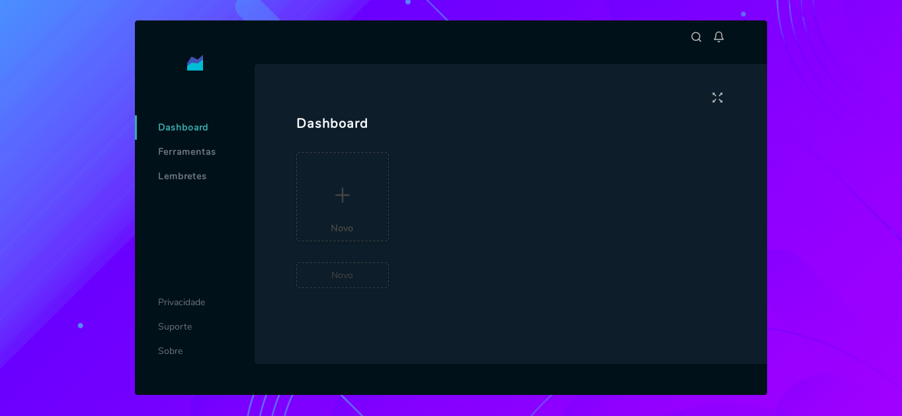

# StockManager
### Ferramenta para gerenciamento de estoques e lembretes.

Ferramenta simples para gerenciamento de produtos em estoque, lembretes e ferramentas.

### Ambiente de desenvolvimento
#### Pré-requisitos
    Python==3.7.3
    Django==3.0.7
    Node==3.6.0   
